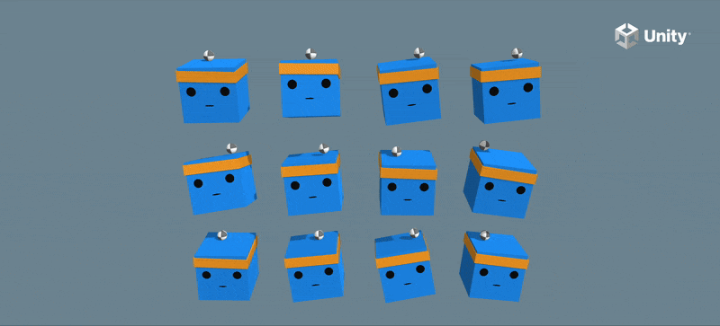
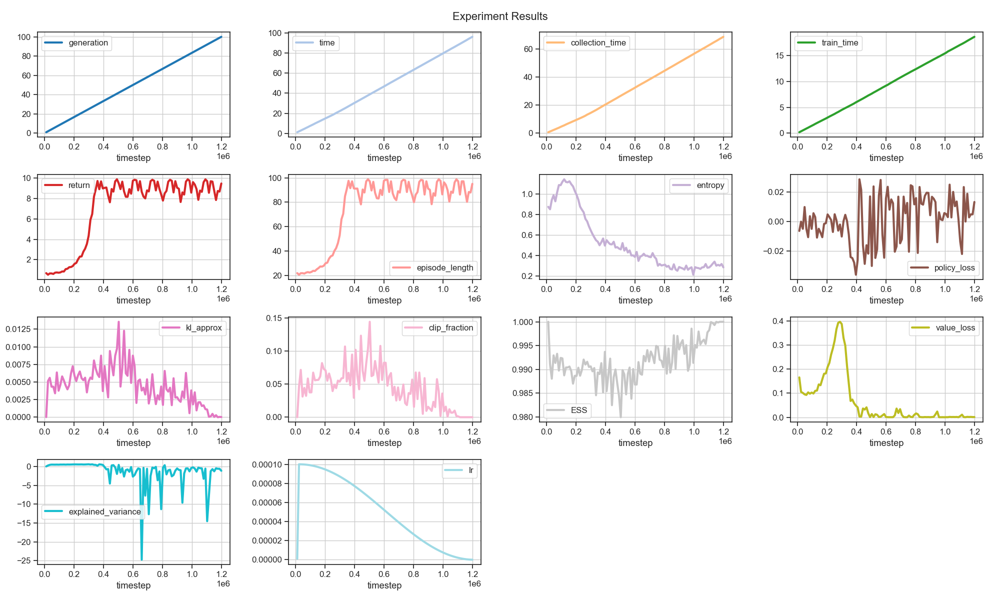
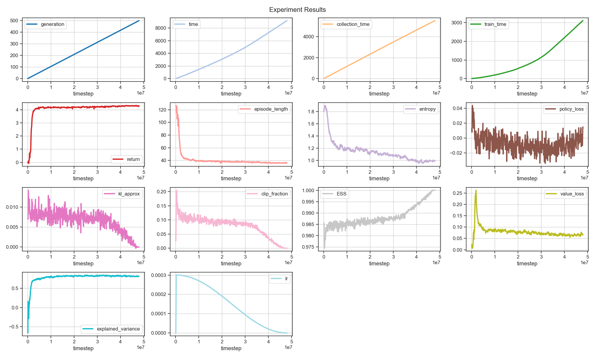
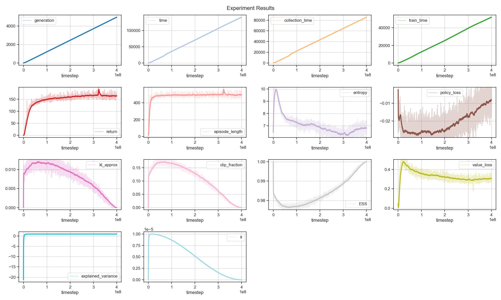

# Unity ML-Agents with TorchRL
This repo contains examples of solving reinforcement learning scenarios from unity [mlagents](https://github.com/Unity-Technologies/ml-agents) with TorchRL. 

_Insert Video Compilation Here_

## **Usage**

**Organization**

There are 2 main components: 
1. rlkit
    - rlkit contains algorithms (like ppo, sac), unity environments (with torchrl transforms), and other utility.

```python
env = UnityEnv(name='3DBall', path=None, graphics=True, time_scale=1, seed=1)
agent = PPOAgent('3DBall', 'conf1', 'run1') # from huggingface: notnotDroid/unity-rl
```

2. experiment runner
    - I use hydra to manage configs for (environment, algorithm, config) tuples. 
    - Experiment results are under experiments/, configs under configs/, and the code for the experiment runner has its entry point at run_experiment.py. 
```bash
python run_experiment.py -cn "config_name" +verbose=True +continue_=False run_name="run_name"
```

### **Unity Environments**
You can either use the built in unity environments or download them manually. The manual download ones look better and may be necessary if the unity registry is down.

**Manual Download**
-  [Download](https://docs.unity3d.com/Packages/com.unity.ml-agents@4.0/manual/Installation.html) the repo containing the environments.

- Then open the project in the unity editor (select the Project/ folder from mlagents), select a scene from an environment and build it for whatever platform you're on.
- Create an env/ folder at the root of this repo and place compiled environments in it.

### **Python Environment**

First of all conda is required (something weird about grpcio, wheel won't build) so make sure its properly setup. Then run these at project root:

```
# Create conda environment
conda create -n mlagents python=3.10.12
conda activate mlagents

# Install mlagents python interface
conda install "grpcio=1.48.2" -c conda-forge
python -m pip install mlagents==1.1.0
python -m pip install numpy==2.2.6

# Install toolkit
python -m pip install pandas matplotlib ipykernel hydra-core seaborn huggingface_hub torchinfo
python -m pip install torch torchrl 
python -m pip install -e rlkit
```
Note that the numpy version conflicts with mlagents because of gym (deprecated), but we don't use gym anyways so we are safe to use the latest version of numpy. This also means we have to manual download everything (no requirements.txt).

### **RLKit**
This package contains reusable resources:
- mlagent environments (with torchrl transforms)
- training templates (ppo/sac)
- utils (checkpointer/logger)
- models (mlp/cnn)

The training templates are meant to be used as templates rather than robust algorithms (customize them).

### **TODO**

1. Finish models for vector environments (Crawler, PushBlock, Walker, WallJump, Worm) remaining
2. Add support for visual environments (GridWorld, Match 3)
3. Add support for multi agent environments (food collector, soccer twos, striker vs. goalie, co-op pushblock, dungeon escape)
4. Add SAC
5. Add support for sparse reward environments (hallway, pryamids)
6. Add support for variable length observation environments (sorter)

- Add Docker support
- Add evaluation function
- Train WallJump

## **Environments**

### **3DBall**


 

**Info**
- vector observation of dim: 8, vector action of dim: 2 (continuous)
- 12 parallel environments
- reward: +0.1 survival, -1 failure 

```python
env = UnityEnv(name='3DBall')
```

**PPO**
<p align="center">
  
</p>

- avg return with window 1000: 100

Train:
```bash
python run_experiment.py -cn 3dball_ppo +verbose=True +continue_=False run_name=run1
```
Model:
```python
agent = PPOAgent('3DBall', 'conf1', 'run1')
```

### **PushBlock**

 

**Info**
- vector observation of dim 210, vector action of dim 7
- 32 parallel environments
- reward -0.0025 step, +1 goal

```python
env = UnityEnv(name='PushBlock')
```

**PPO**

<p align="center">
  
</p>

- avg return with window 1000: 4.5


Train:
```bash
python run_experiment.py -cn pushblock_ppo +verbose=True +continue_=False run_name=run1
```
Model:
```python
agent = PPOAgent('PushBlock', 'conf1', 'run1')
```

### **Crawler**

 


**Info**
- vector observation of dim 158, vector action of dim 20
- 10 parallel environments
- Dense reward (see [mlagents-examples](https://github.com/Unity-Technologies/ml-agents/blob/main/docs/Learning-Environment-Examples.md) for details)

```python
env = UnityEnv(name='Crawler')
```

**PPO**

<p align="center">
  
</p>

- avg return with window 1000: 360


Train:
```bash
python run_experiment.py -cn crawler_ppo +verbose=True +continue_=False run_name=run9
```
Model:
```python
agent = PPOAgent('Crawler', 'conf1', 'run9')
```